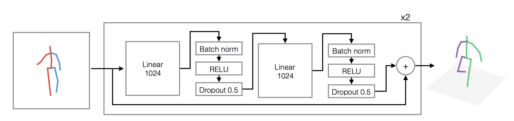

# SimpleBaseline
This repository is an implementation of the paper [A simple yet effective baseline for 3d human pose estimation](https://arxiv.org/pdf/1705.03098.pdf).

The [official code](https://github.com/una-dinosauria/3d-pose-baseline) was written in TensorFlow.

This paper was the first attempt to consider 3D human pose estimation as a 2D-3D lifting task.

It has been cited in many papers to be the baseline of lifting methods.


```
@inproceedings{martinez_2017_3dbaseline,
  title={A simple yet effective baseline for 3d human pose estimation},
  author={Martinez, Julieta and Hossain, Rayat and Romero, Javier and Little, James J.},
  booktitle={ICCV},
  year={2017}
}
```


<p align="center"></p>


### TODO
- [ ] Upload pre-trained model
- [ ] Benchmark pre-trained model and make table
- [ ] Complete README